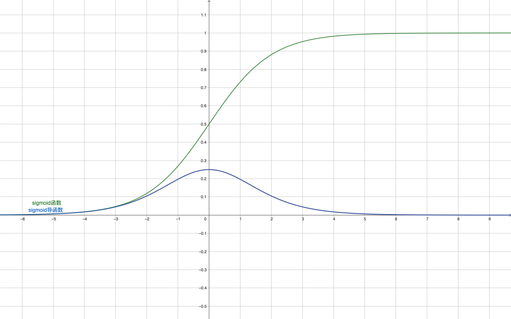

# Welcome to neural network!

本文是学习笔记，[原文](http://neuralnetworksanddeeplearning.com/index.html)

### 全连接层架构的神经网络

#### 反向传播算法

反向传播的基本原理是导数求极值的原理（在导数的方向上变动变量，可以让结果更小），让调参的方向跟Cost变小一致；
在一个特定的N(x，y)样本中，代价函数是参数的一个函数，二次代价函数是其中一个：

$$
C(_{w},_{b}) = \frac{1}{2n}\sum||a - y|| \qquad  其中 a = w*x + b，求和对象是误差的模
$$

根据链式求导，定义$f_{L}$深度为L层的网络最后一层的梯度因子，它是从代价函数$C(a_{L})$传递到L层带权输出$z_L$的偏导，结合激活函数$a_{L} = \sigma({z_L})$ :

$$
f_{L} = \frac{\partial C}{\partial z_{L}} = (a_{L}-y)*\sigma^,(z_{L})\qquad  (1)
$$

因为 $z_L = w_L * x + b_L$，所以：

$$
\frac{\partial C}{\partial b_{L}} = f_L * 1  \qquad
\frac{\partial C}{\partial w_{L}} = f_L @ (a_{L-1})^T
$$

继续向L-1层传播

$$
f_{L-1} = \frac{\partial C}{\partial z_{L-1}} = (w_{L})^T @ f_{L} * \sigma^,(z_{L-1})
$$

$$
\frac{\partial C}{\partial b_{L-1}} = f_{L-1} * 1  \qquad
\frac{\partial C}{\partial w_{L-1}} = f_{L-1} @ (a_{L-2})^T
$$

#### 实验结果说明

* 代码
  
  1. v1 版本，面向对象的版本
  2. v2 版本，集中在network里计算，没有按照预期那样出现更好的性能表现
* 关于激活函数
  
  1. 激活函数以及对应的导数值域在0到1之间分布，避免反向传播计算梯度时出现爆炸
  2. 在计算忽略最后一层的sigmoid激活函数在梯度中的偏导，意外获得了更快的学习，但理论上是有问题的，可能带来更大的震荡；
  3. 激活函数以及对应的导数要在0到1之间分布，其一用于归一，其二可以避免爆炸
  4. 激活函数要求连续可导，为了拟合计算（求导）可行
  5. 对于sigmoid函数，当z的绝对值大于4之后，很迅速的贴近y=0和y=1两条线，在那个范围切线变化的很慢，所以带权输出z过大的神经元学习很慢
  6. sigmoid激活函数的导函数阈值是(0,0.25]，所以随着深度加大，反向传播中浅层的梯度迅速消失，所有有*tanh*、*relu*以及*sinh*等替代函数
     
* 关于层数和神经元数量
  
  1. 更深的隐藏层或者更多的隐藏神经元不一定带来更好的效果
* 关于随机样本迭代
  
  1. 小样本随机梯度可以加快学习，因为随机小样本迭代的特点：快速获得特征，小步调整，更敏捷；
  2. 小样本的大小取值并不是越小越好，可能不能及时获取到特征
  3. 小样本太大效果也不一定好，可能会拟合更多的非有效特征导致**过拟合**问题（跟样本拟合很好，代价很小，但是验证精度反而更低）
* 针对识别数字这个问题，全连接层架构的准确率极限在97%左右
* 效果跟初始化的参数有很大关系，开始效果比较差的情况下，学习进度没谱，可能要迭代很多次才能有明显进展，可能跟上述激活函数第六条特性有关；

#### 其他

* exp(z) 容易溢出，没有特别好的解决办法；更换激活函数；

### 改进神经网络的技术

#### 交叉熵代价函数

之前提到，如果带权输出$z_{L}$的值比较大，sigmoid的导函数值将很小，会导致学习缓慢；

从反向传播的公式1看，在导函数$\sigma^,(z_{L})$前还有个代价函数对${a_{L}}$的偏导部分；能不能抵消掉？

所以**交叉商代价函数**被提出来，其中要的特性就是在计算$f_{L}$时正好把$\sigma^,(z_{L})$约掉了，而且剩下一个与误差正相关的梯度因子（误差越大，梯度越大），以此达到优化梯度学习的目的

$$
C = -\frac{1}{n}\sum[y*lna + (1-y)*ln(1-a)]
$$

根据对数函数的图可以看出，y和1-y都在（0，1）之间，当a越靠近y时，可以认为围出来的面积（负的）越最大，所以代价也就越小，但是这个代价有个最小值，并不能等于零。
这个代价函数对输出a求导的结果正好是

$$
\frac{(a-y)}{a*(1-a)} = \frac{(a-y)}{\sigma^{,}(z)}
$$

所以，在这个代价函数的支持下，$f_{L} = \frac{\partial C}{\partial z_{L}} = (a_{L}-y)$，加快了速度，也简化了计算。
得到的启示是，理论上选择合适的代价函数，可以简化反向传播的计算

**交叉熵改进的时候学习的速率，特别是学习输出与预期相差较大时，天然的加快学习；对学习的精度有改进**

问题来了：什么时候选择二次代价函数，什么时候选择交叉熵代价函数

**应该是取决于输出层的激活函数，如果输出层激活函数是S型的，交叉熵更合适，如果线性的，二次代价也行，其实就是看实际需不需要激活函数的偏导部分**

